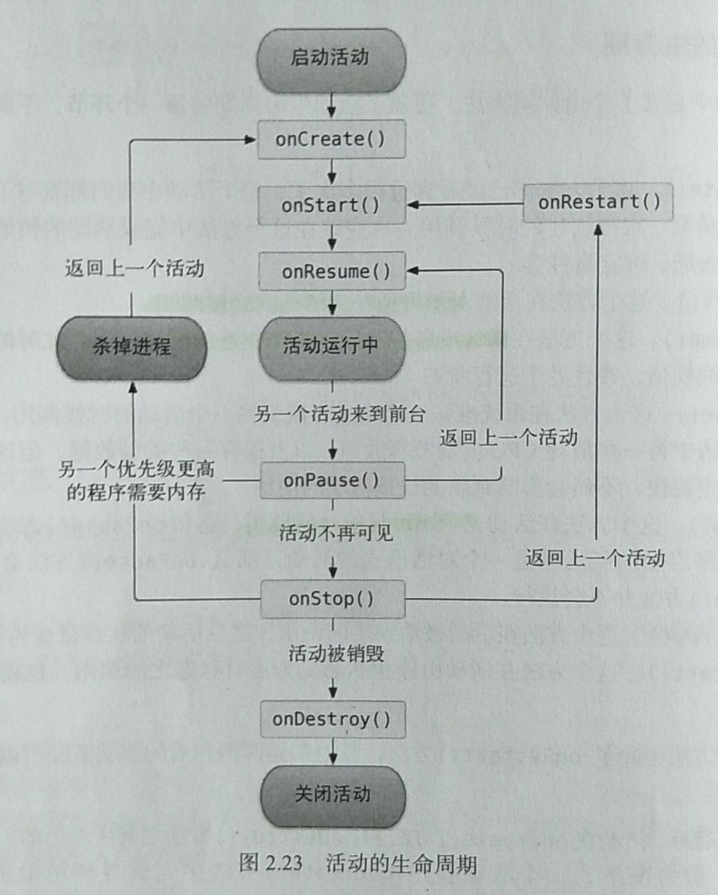

# 第2章 先从看得到的入手——探究活动  
## 2.4 活动的声明周期  
### 2.4.1 返回栈  
使用任务(task)管理活动,一个任务就是一组存放在返回栈(Back Stack)里的活动集合.  
栈:先进后出的数据结构  
#### 作用  
启动新活动入栈,finish()销毁活动出栈.  
系统总会显示处于栈顶的活动给用户.
### 2.4.2 活动状态
4种状态  
#### 运行状态  
栈顶、可见  
#### 暂停状态  
非栈顶、可见  
回收：内存极低时  
#### 停止状态  
非栈顶、完全不可见  
保留相应状态和成员变量  
回收：其他地方需要内存时  
#### 销毁状态  
返回栈中移除后  
回收：最倾向于回收处于这种状态的活动，确保内存充足    
### 2.4.3 活动的生存期  
Activity类中定义了7中回调方法。  
#### 完整生存周期  
- onCreat()  
- onDestroy()
#### 可见生存周期  
- onStart()  
- onStop()
#### 前台生存周期  
- onResume()
- onPause()
#### 此外
- onRestart()  
#### 生命周期示意图  

#### onStart和onRestert的区别  
onRestart()在Destory后在启动程序的情况下**不会启动**  
目前知道两种情况只启动onStart()不启动onRestart():  
1. 刚启动程序的时候  
2. 屏幕翻转(屏幕翻转会Destory这个活动然后重新创建启动)   

where in `Head First Android book` it is stated that:

>" : When you rotate the device, the activity is destroyed and a new one is created in its place. If we’d put code in the onRestart() method instead, it wouldn’t have run when the activity was re-created. The onStart() method gets called in both situations."

>onRestart() is called only if onStop() has been called before
>
>https://developer.android.com/guide/components/activities/activity-lifecycle.html
>
>The activity was stopped and you are RE-starting it hence onRestart(). The very first time or after the activity has been destroyed it's just onStart()

来源:[https://stackoverflow.com/questions/46867109/what-is-the-difference-between-onrestart-and-onstart](https://stackoverflow.com/questions/46867109/what-is-the-difference-between-onrestart-and-onstart)  
